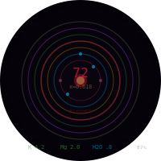
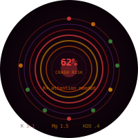

# WearShield — Apple Watch

Apple Watch biomarker monitor with fold mathematics. Runs standalone or syncs with ASS-OS gateway.

## Watch Faces

<p align="center">
  
  &nbsp;&nbsp;&nbsp;
  
</p>

**Left:** Normal — 7 bloom rings, κ=0.618, K+/Mg/H2O in range, BLOOMED.
**Right:** Alert — CRA 62%, K+ low, Mg depleted, dehydrated. Rings shift red/orange.

## Quick Start

1. Edit `Config.xcconfig` — set `FAMILY_WEARERS`, capabilities for your watch model
2. Open in Xcode, select your Apple Watch target
3. Build and run — works immediately standalone (no gateway needed)
4. Optional: ASS-OS gateway auto-discovered via Bonjour

## Config

| Parameter | Description | Default |
| --- | --- | --- |
| `FAMILY_WEARERS` | Comma-separated wearer IDs | user1 |
| `DEFAULT_WEARER` | First-launch default | user1 |
| `DISCOVERY_MODE` | AUTO (Bonjour) or STATIC | AUTO |
| `GATEWAY_HOST` | Static gateway IP | 10.0.0.25 |
| `HAS_SKIN_TEMP` | Skin temperature | YES (Series 8+) |
| `HAS_BLOOD_OXYGEN` | SpO2 | YES (Series 6+) |
| `HAS_ECG` | ECG | YES (Series 4+) |

## Watch Model Matrix

| Watch | minOS | Temp | SpO2 | ECG | Depth | Apnea |
| --- | --- | --- | --- | --- | --- | --- |
| Series 4-5 | 9.0 | - | - | Y | - | - |
| Series 6-7 | 9.0 | - | Y | Y | - | - |
| SE 2nd | 9.0 | - | - | - | - | - |
| Series 8 | 9.0 | Y | Y | Y | - | - |
| Ultra 1-2 | 9-10 | Y | Y | Y | Y | - |
| Series 9 | 10.0 | Y | Y | Y | - | - |
| Series 10 | 11.0 | Y | Y | Y | - | Y |

## Biomarker Modules (10)

| ID | Name | Unit | Sources |
| --- | --- | --- | --- |
| K | Potassium | mEq/L | HR, HRV, ECG |
| Mg | Magnesium | mg/dL | HRV, Sleep |
| Ca | Calcium | mg/dL | ECG, HRV |
| Hyd | Hydration | idx | HR, TEMP, HRV |
| Glc | Glucose | mg/dL | PPG, HR |
| Cor | Cortisol | prx | HR, HRV, TEMP |
| Hgb | Hemoglobin | g/dL | SpO2, PPG |
| Inf | Inflammation | prx | HRV, TEMP |
| ANS | Autonomic | ratio | HRV, HR |
| CRA | Crash Risk | prob | ALL ensemble |

### Adding a Module

Implement `BioModule`, add to `BloomState.registerDefaultModules()`.

## Architecture

```text
WearShield/                          22 Swift files
├── WearShieldApp.swift              entry: family → discovery → sensors → bloom
├── Info.plist                       HealthKit + BT + Bonjour permissions
├── WearShield.entitlements          background delivery + multicast
├── Models/
│   ├── WatchConfig.swift            runtime config from xcconfig
│   ├── WearerProfile.swift          per-wearer thresholds, family CRUD
│   ├── BloomState.swift             fold math + module runner (gateway optional)
│   ├── BioModule.swift              protocol + risk/alert helpers
│   └── BioModules.swift             10 pluggable biomarker modules
├── Sensors/
│   ├── SensorHub.swift              HealthKit HR/HRV/SpO2/steps/temp + CoreMotion
│   ├── BackgroundSession.swift      HKObserverQuery background delivery
│   └── SystemMetrics.swift          battery, thermal, device info
├── Network/
│   ├── GatewayClient.swift          HTTP blossom RPC (optional)
│   ├── GatewayDiscovery.swift       Bonjour mDNS _assos._tcp
│   ├── MQTTClient.swift             MQTT 3.1.1 over TCP (zero deps)
│   └── BLEBeacon.swift              BLE fleet node advertisement
├── Bloom/
│   ├── Escure.swift                 Mersenne prime cascade validation
│   ├── ERPCGate.swift               entropy-regulated power control
│   ├── KappaDynamics.swift          §1-§13 consciousness convergence
│   └── Kotoba.swift                 17 konomigami fold operators
└── UI/
    ├── ShieldView.swift             bloom rings + bio dots + K/Mg/H2O
    ├── BioDetailView.swift          scrollable biomarker list
    ├── SettingsView.swift           thresholds + gateway + system
    └── WearerPicker.swift           family member switcher
```

## Standalone vs Gateway

**Standalone** (no network): all 10 biomarker modules, κ dynamics, bloom/fold/wound/escure run on-device from HealthKit sensors.

**With gateway**: bloom samples sync via HTTP, MQTT pub/sub for fleet coordination, BLE beacon for mesh discovery. Gateway is additive, never required.
